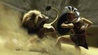
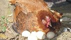

# Teste Rep


[](toc)
- [01. Operações: Impressão formatada](#01-operações-impressão-formatada)
- [02. Operações: Biblioteca Math](#02-operações-biblioteca-math)
[](toc)

```
Conteúdo sugeridos
- instalando o mingw e vscode
- tipos de dados básicos: `bool, int, float, char, const char *`
- operadores aritméticos: `+ - * / %`
- lendo e escrevendo variáveis: scanf, printf, puts, getchar
- uso avançado do scanf
- maldição da leitura do char, lendo ou ignorando whitespaces
- lendo errado a entrada, limpando o buffer
- como funciona o buffer de entrada
- utilizando funções da biblioteca math.h
- debugando
```

## 01. Operações: Impressão formatada
\________________________ | \_______________________________________________
------------------------- | -----------------------
 | [@000 L1 - Operações básicas](base/000/Readme.md)
 | [@010 L3 - Bolinhas viciadas](base/010/Readme.md)
 | [@011 L2 - Formatando data](base/011/Readme.md)


## 02. Operações: Biblioteca Math
\________________________ | \_______________________________________________
------------------------- | -----------------------
 | [@012 L2 - Deu a louca no Imperador!](base/012/Readme.md)
 | [@013 L1 - Sapatos para 3](base/013/Readme.md)
 | [@014 L1 - Quantos são iguais?](base/014/Readme.md)
 | [@015 L1 - Calculadora Numérica 💎](base/015/Readme.md)
 | [@016 L2 - Volta de 360 graus - Retirando os loops](base/016/Readme.md)
 | [@017 L2 - Maior ovo](base/017/Readme.md)
 | [@018 L2 - Arredondar](base/018/Readme.md)
 | [@019 L2 - Game 10 - OBI 2017 - Fase 1 - Universitário](base/019/Readme.md)

